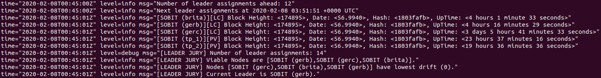
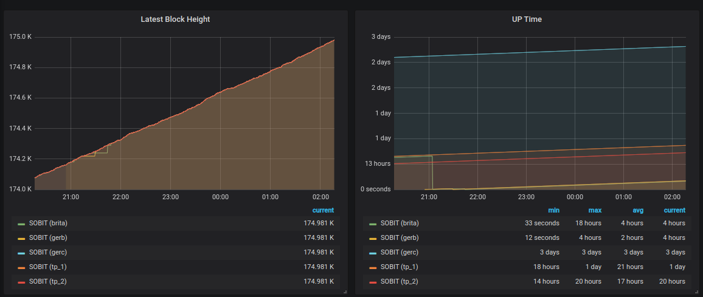

# THOR MONITORING

Thor is a tool for taming a swarm of Jörmungandr nodes. It provides at the moment the following functions.

* Monitoring
* PoolTool Tip Updating
* Email Reporting
* Leader Election

See the corresponding sections below to get detailed information. An demo orchestration with docker-compose can be found
in the demo folder.

## Peers
This tool is centered around peers and a peer must be uniquely identified by a name.  A peer must moreover specify its
API endpoint. In the following, a list of possible properties is listed with a description.

| Name | Description | Required |
|---| ---- | ----- |
| name | unique name of this peer | Yes |
| api | location of the API endpoint as URL | Yes |
| type | specifies whether a peer is passive (i.e. "passive") or a leader candidate (i.e. "leader-candidate"). This property is only relevant for the leader election jury, the default is "passive". | No |
| maxBlockLag | a property for the monitor that specifies how many blocks a peer can lag behind the maximum known block height before taking a certain action (e.g. shutdown, reporting, etc.)  | No |
| maxTimeSinceLastBlock | a property for the monitor that specifies how many milliseconds the creation date of most recently received block can lie behind | No |
|warmUpTime| a property that tells the monitor to execute no actions (e.g. shutdown) in the first specified number of milliseconds |No|

Example:
```
peers:
  - name: "Local 1"
    api: http://jormungandr-1:3101
    maxTimeSinceLastBlock: 60000
  - name: "Local 2"
    api: http://jormungandr-2:3101
    maxBlockLag: 10
  - name: "Local 3"
    api: http://jormungandr-3:3101
    maxTimeSinceLastBlock: 60000
```

## Block Chain Settings
In order to have all the functions available, please specify the following settings of the blockchain.

| Name | Description |
|---| ---- |
| genesisBlockHash |  the hash of the genesis block |
| genesisBlockTime | the exact date, when the genesis block has been created |
| slotsPerEpoch | the number of slots per epoch |
| slotDuration | the duration of a slot |

Settinsg for "ITN-Rewards" block chain.
```
blockchain:
  genesisBlockHash: "8e4d2a343f3dcf9330ad9035b3e8d168e6728904262f2c434a4f8f934ec7b676"
  genesisBlockTime: "2019-12-13T19:13:37+00:00"
  slotsPerEpoch: 43200
  slotDuration: 2000
```

## Functions

### Monitor

A node is continuously compared to the latest block height reported by other nodes and if a node falls behind a 
specified number `x` of blocks or the creation date of the most recent received block is `x` milliseconds behind,
then the node is shutdown gracefully. It is expected that the node is restarted automatically on the system on which
it is running (systemd, docker swarm, kubernetes, etc.).

Keep in mind, if you specify the block chain settings (see above), then the monitor is aware of the exact times of
scheduled blocks and the monitor will not bother the peers at those times with API requests.

Logging output of the monitor (plus leader jury):



### Pool Tool Tip Updater

A user can optionally specify the required information listed below, and the tool is going to report the maxmimum height
reported among the monitored peers to Pool Tool. The interval is hardcoded and is at the moment at 30 seconds,
i.e. twice a minute. Keep in mind, that you have specify the block chain settings (see above) to use this function.

| Name | Description |
|---|---|
| userID | user ID that one has to request from pool tool |
| poolID | ID of the pool for which the maximum shall be reported |

Example:
```
pooltool:
  userID: xxxxxxx-xxxx-xxx-xxxx-xxxxxxxxxx
  poolID: 28099aba9ea7c89cdb2a44a4c6640e4137e1939bd75451202c67dd384814dfc9
```

## Prometheus

This tool can be turned into a Prometheus client (i.e. it can be added as a target to a job). What is needed, is
the `hostname` and `port` on which the client shall be started.

Example:
```
prometheus:
  hostname: "0.0.0.0"
  port: "9200"
```

The provided metrics are listed in the table below.

| Name | Description |
|---|----|
| thor_jormungandr_last_block_height | The latest block height reported by this Jörmungandr node. |
| thor_jormungandr_tx_received_count | The number of transaction received by this Jörmungandr node. |
| thor_jormungandr_peer_available_count | The number of peers available to this Jörmungandr node. |
| thor_jormungandr_peer_quarantined_count | The number of peers quarantined to this Jörmungandr node. |
| thor_jormungandr_peer_unreachable_count | The number of peers unreachable to this Jörmungandr node. |
| thor_jormungandr_uptime | The uptime reported by this Jörmungandr node. |


Grafana visualization of a subset of the provided metrics:



## Leader Jury
The aim of the leader jury is to select the healthiest node among the peers specified as "leader-candidate" for minting
the next scheduled block. It keeps a record of the `window` most recent fetched node statistics (from the monitor) for 
each node and assesses the health for each leader. The health of a node is specified at the moment by how little it 
drifted away from the maximum reported block height in this window. More recent drifts are weighted more than drifts of 
the past. An exclusion zone can be specified such that no leader change can happen `exclusionZone` seconds in front of 
a scheduled block. This mechanism shall prevent missed blocks as well as adversorial forks. 

The epoch turn over is a challenging task with the current design of Jormungandr. In the new strategy since `2.0.0`, all
leader candidates are promoted before an epoch turn over and demote all but the elected leader shortly after the turn 
over. The program will check whether all the leader candidates have computed the schedule correctly, and will exclude 
non viable candidates from being elected until they have computed the schedule correctly. The last resort is a shutdown
of the node (i.e. a restart).

Keep in mind, that you have specify the block chain settings (see above) to use this function.

| Name | Description | Default |
|---|---| ---- |
| cert | path to the  node-secret YAML configuration file | -no default- |
| window | number of checkpoints (occur in the frequency of `interval`ms) that shall be considered for the health metric | 5 |
| exclusionZone | number of milliseconds in front of a scheduled block in which no leader change is allowed | 30s |

```
monitor:
  interval: 1000
  leaderJury:
    cert: node-secret.yaml
    window: 8
    exclusionZone: 10
```

**Attention: This tool is not demoting nodes after bootstrap. Please make use of the [guardian](https://github.com/sobitada/guardian)
for this. The guardian shall be executed side-by-side to a Jörmungandr node. It will monitor the bootstrap and
immediately demote the node after bootstrap.**

Example script using the guardian:
```
/opt/jormungandr/bin/guardian -i="${GUARD_INTERVAL:-1000}" $NODE_CONFIG_PATH &
/opt/jormungandr/bin/jormungandr --genesis-block-hash $GENESIS_BLOCK_HASH  \\
    --config $NODE_CONFIG_PATH --secret $NODE_SECRET_PATH "$@"
```

## Run
```
Usage:
	thor <config>

Arguments:
	config - YAML configuration for this thor instance.
```

The configuration looks like this. You can specify the swarm of peers and the interval in which their status shall be
checked as well as the logging level.
```
logging:
  level: info
blockchain:
  genesisBlockHash: "8e4d2a343f3dcf9330ad9035b3e8d168e6728904262f2c434a4f8f934ec7b676"
  genesisBlockTime: "2019-12-13T19:13:37+00:00"
  slotsPerEpoch: 43200
  slotDuration: 2000
peers:
  - name: "Local 1"
    api: http://jormungandr-1:3101
    maxBlockLag: 10
  - name: "Local 2"
    api: http://jormungandr-2:3101
    maxBlockLag: 10
    maxTimeSinceLastBlock: 60000
  - name: "Local 3"
    api: http://jormungandr-3:3101
    maxTimeSinceLastBlock: 60000
monitor:
  interval: 1000
prometheus:
  hostname: "0.0.0.0"
  port: "9200"
```

You should have a setup of your jormungandr node in which it automitically restarts after a shut down (e.g. systemd,
docker compose/swarm, kubernetes). This is expected by this tool.

## Build
You need to have the Go language installed on your machine; instructions are [here](https://golang.org/doc/install#install). Then
you have to fetch the source code of this repository, which can be done with the following command.

```
go get github.com/sobitada/thor
```

Then you can build this program with the following step.

```
go build github.com/sobitada/thor
```

Afterwards you should see an executable named `thor` for your OS and architecture in the current working directory.

## Feedback

If you have any suggestions, feel free to open an issue or submit a pull request.

TICKER: SOBIT
